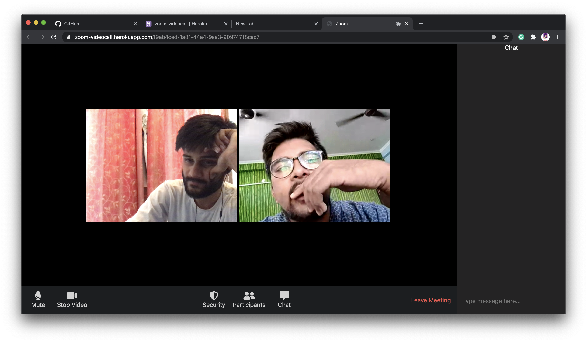

# ZoomVideoCall-NodeJS
Realtime Video Call (Zoom Clone) using PeerJS and Socket.io

* Peer-to-Peer video call.
* Play / Stop video any time.
* Mute / Umute Microphone.
* Realtime Chat.

## Preview

   

### Special Appearance: [Hritik Rai](https://github.com/Vector26)
